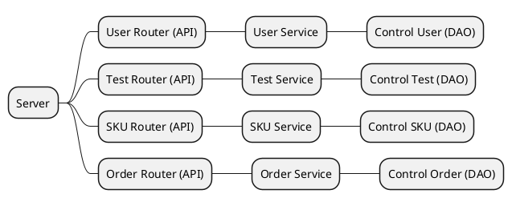
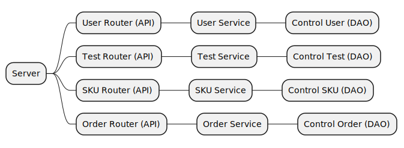

# Integration and API Test Report

Date:

Version:

# Contents

- [Dependency graph](#dependency graph)

- [Integration and API Test Report](#integration-and-api-test-report)
- [Contents](#contents)
- [Dependency graph](#dependency-graph)
- [Integration approach](#integration-approach)
- [Integration Tests](#integration-tests)
  - [Step 1](#step-1)
- [API testing - Scenarios](#api-testing---scenarios)
  - [Scenario UCx.y](#scenario-ucxy)
- [Coverage of Scenarios and FR](#coverage-of-scenarios-and-fr)
- [Coverage of Non Functional Requirements](#coverage-of-non-functional-requirements)
    - 

- [Tests](#tests)

- [Scenarios](#scenarios)

- [Coverage of scenarios and FR](#scenario-coverage)
- [Coverage of non-functional requirements](#nfr-coverage)

# Dependency graph 

     <report the here the dependency graph of the classes in EzWH, using plantuml or other tool>

# Integration approach

    The integration sequence adopted is Bottom Up.
    

#  Integration Tests

   <define below a table for each integration step. For each integration step report the group of classes under test, and the names of
     Jest test cases applied to them, and the mock ups used, if any> Jest test cases should be here code/server/unit_test

## Step 1
| Classes  | Jest test cases |
|--|--|
|controlUser + userService| create and retrive new User, create new User that already exist, get new supplier, get supplier without supplier in db, check for newUser done, check for newUser bad, check for update/del user done, check for update/del user bad, do session with right credentials, do session with credentials incorrect, change user right, delete user|
| controlTest (testDescriptor) + testService | get testDescriptor, create testDescriptor data, testDescriptor no sku associated idSKU, modify testDescriptor data with success, testDescriptor no test descriptor associated id or no sku associated to IDSku, delete testDescriptor, delete testDescriptor validation of id failed |
| controlTest (testResult) + testService| get testResult, create testResult data, testResult no sku item associated to rfid or no test descriptor associated to idTestDescriptor, modify testResult data, testResult no sku item associated to rfid or no test descriptor associated to idTestDescriptor, delete testResults, delete testResults validation of id failed |
|controlSKU (SKUItem) + SKUService| get SKUItem, modify SKUItem data with success, create SKUItem data, SKUItem with 404, get SKUItemAvailable|
|controlSKU (Position) + SKUService| get Position, Positions modification success, Positions modification error (newOccupiedWeight > newMaxWeight), Positions modification error (not only digits in newRow), Position with success, Postion with 422 (not derived error), Postion with 422 (wrong aisleid length), PositionID modification success, PositionID modification error (not only digits), PositionID modification error (not only digits in old position)  |
|controlSKU (Item) + SKUService| get Item, modify Item data with success, modify Item data with error (new price negative), delete Items, delete Item empty, delete Item with 404 error |
|controlOrder (restock Order) + orderService | create an order, delete an order, fail to cerate an order, modify state of an order, fail to modify an order by its ID, retrive de SKUs and try wrong ID, try to modify note with wrong ID |

# API testing - Scenarios

<If needed, define here additional scenarios for the application. Scenarios should be named
 referring the UC in the OfficialRequirements that they detail>

## Scenario UCx.y

| Scenario |  name |
| ------------- |:-------------:| 
|  Precondition     |  |
|  Post condition     |   |
| Step#        | Description  |
|  1     |  ... |  
|  2     |  ... |

# Coverage of Scenarios and FR

<Report in the following table the coverage of  scenarios (from official requirements and from above) vs FR. 
Report also for each of the scenarios the (one or more) API Mocha tests that cover it. >  Mocha test cases should be here code/server/test

| Scenario ID | Functional Requirements covered | Mocha  Test(s) | 
| ----------- | ------------------------------- | ----------- | 
| 1-1 (create SKU) | FR2.1 (create/modify) | createSKUItem() |             
| 1-2 (modify SKU location)  | FR2.4(search)   FR2.1 | getSKUItems()   modifySKUItem() |             
| 1-3 (modify SKU weight volume) | FR2.4   FR2.1 | getSKUItems()   modifySKUItem() |             
| 2-1 (create Position) | FR3.1.1 (create/modify) | createPosition() |             
| 2-2 (modify Position ID) | FR3.1.3 (list)   FR3.1.1  | getPositions()   modifyPositionID() |             
| 2-3 (modify weight volume of p) | FR3.1.3   FR3.1.4 (modify attr)  |  getPositions()   modifyPosition()   |  
| 2-4 (Modify aisle ID, row and column of P) | FR3.1.3   FR3.1.4 | getPositions()   modifyPosition()|  
| 2-5 (Delete Position) | FR3.1.3   FR3.1.2 (delete) | getPositions()   deletePosition()|           
| 3-1 (Restock Order of SKU S issued by quantity) | FR5.1   FR5.3    FR5.2    FR5.5   FR5.6 | newRestockOrder()   modifyRestockOrderState()   modifyRestockOrderSkuItems() |           
| 3-2 (Restock Order of SKU S issued by supplier) | FR5.1   FR5.3    FR5.2    FR5.5   FR5.6 | newRestockOrder()   modifyRestockOrderState()   modifyRestockOrderSkuItems()|      
| 4-1 (Create user and define rights) |  FR1.1   FR1.5 | newUser()   updateUserType()|           
| 4-2 (Modify user rights) | FR1.4   FR1.3   FR1.5 | getUsers()   updateUserType()|  
| 4-3 (Delete user) | FR1.4   FR1.3   FR1.2 | getUsers()   deleteUser()|  
| 5-1-1 (Record restock order arrival) | FR5.8.1   FR5.8.3   FR5.7  | newRestockOrder() |  
| 5-2-1 (Record positive test results of all SKU items of a RestockOrder) | FR5.8.2   FR5.7  | createTestResult() |  
| 5-2-2 (Record negative test results of all SKU items of a RestockOrder) | FR5.8.2   FR5.7  | createTestResult() |  
| 5-2-3 (Record negative and positive test results of all SKU items of a) | FR5.8.2   FR5.7  | createTestResult() |  
| 5-3-1 (Stock all SKU items of a RO) | FR3.1.4   FR2.1  FR5.7 | modifySKU()   modifySKUPosition()   modifyPosition() |  
| 5-3-2 (Stock zero SKU items of a RO) |  FR5.7 | getTestResult()   modifyRestockOrderState()|
| 5-3-3 (Stock some SKU items of a RO) | FR3.1.4   FR2.1  FR5.7 |  modifySku()   modifySKUPosition()   modifyPosition()|  
| 6-1 (Return order of SKU items that failed quality test) | FR5.9  | getTestResult()   newReturnOrder()   modifySKUItem() |  
| 6-2 (Return order of any SKU items) | FR5.9   FR2.1 | getTestResult()   newReturnOrder()   modifySKUItem()   modifyPosition()   modifySku() |  
| 7-1 (Login) | FR1.5 (modify user rights) | managerSession()   customerSession()   supplierSession()   clerkSession()    qualityEmployeeSession()   deliveryEmployeeSession() |  
| 7-2 (Logout) | // ||  
| 9-1 (Internal Order IO accepted) | FR6.3 (qty of sku)   FR6.2(add sku)   FR6.7 (change state)  decrease availab   FR6.6 (Accept) |newInternalOrder()   modifyInternalOrderState()|  
| 9-2 (Internal Order IO refused) | FR6.3   FR6.2   FR6.7    decrease availab   FR6.6 | newInternalOrder()   modifyInternalOrderState() |  
| 9-3 (Internal Order IO cancelled) | FR6.3   FR6.2   FR6.7    decrease availab   FR6.6  | newInternalOrder()   modifyInternalOrderState()|  
| 10-1 (Internal Order IO Completed) | FR6.8 (manage delivery)    (set skuitem not avail)   FR6.7 | modifySkuItem()   modifyInternalOrderState()|  
| 11-1 (Create Item I) | FR7 | createItem() |  
| 11-2 (Modify Item description and price) | FR7 | getItem()   modifyItem()|  
| 12-1 (Create test description) | FR3.2.1 | createTestDescriptor() |  
| 12-2 (Update test description) | FR3.2.2 | getTestDescriptors()   modifyTestDescriptor()|  
| 12-3 (Delete test description) | FR3.2.3 | getTestDescriptors()   deleteTestDescriptor()|  

         

# Coverage of Non Functional Requirements

<Report in the following table the coverage of the Non Functional Requirements of the application - only those that can be tested with automated testing frameworks.>

### 

| Non Functional Requirement | Test name |
| -------------------------- | --------- |
|            NFR4(Position)                |   createPosition(), modifyPosition(), modifyPositionId() |
|            NFR6(rfid 32 digits)          |   createSKUItem(), modifySKUItem() |
|            NFR9(DateFormat)              |   createSKUItem(), modifySKUItem(), newRestockOrder(), newReturnOrder(), newInternalOrder()|

