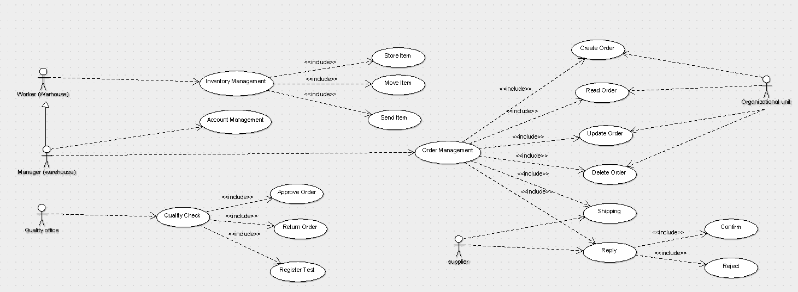

# Requirements Document

Date: 2 April 2022

Version: 0.0

| Version number | Change |
| -------------- | :----- |
|                |        |

# Homeworks

| Name | Work |
| ---- | :--- |
|      |      |

# Contents

- [Informal description](#informal-description)
- [Stakeholders](#stakeholders)
- [Context Diagram and interfaces](#context-diagram-and-interfaces)
  - [Context Diagram](#context-diagram)
  - [Interfaces](#interfaces)
- [Stories and personas](#stories-and-personas)
- [Functional and non functional requirements](#functional-and-non-functional-requirements)
  - [Functional Requirements](#functional-requirements)
  - [Non functional requirements](#non-functional-requirements)
- [Use case diagram and use cases](#use-case-diagram-and-use-cases)
  - [Use case diagram](#use-case-diagram)
  - [Use cases](#use-cases) + [Relevant scenarios](#relevant-scenarios)
- [Glossary](#glossary)
- [System design](#system-design)
- [Deployment diagram](#deployment-diagram)

# Informal description

Medium companies and retailers need a simple application to manage the relationship with suppliers and the inventory of physical items stocked in a physical warehouse.
The warehouse is supervised by a manager, who supervises the availability of items. When a certain item is in short supply, the manager issues an order to a supplier. In general the same item can be purchased by many suppliers. The warehouse keeps a list of possible suppliers per item.

After some time the items ordered to a supplier are received. The items must be quality checked and stored in specific positions in the warehouse. The quality check is performed by specific roles (quality office), who apply specific tests for item (different items are tested differently). Possibly the tests are not made at all, or made randomly on some of the items received. If an item does not pass a quality test it may be rejected and sent back to the supplier.

Storage of items in the warehouse must take into account the availability of physical space in the warehouse. Further the position of items must be traced to guide later recollection of them.

The warehouse is part of a company. Other organizational units (OU) of the company may ask for items in the warehouse. This is implemented via internal orders, received by the warehouse. Upon reception of an internal order the warehouse must collect the requested item(s), prepare them and deliver them to a pick up area. When the item is collected by the other OU the internal order is completed.

EZWH (EaSy WareHouse) is a software application to support the management of a warehouse.

# Stakeholders

| Stakeholder name  | Description |
| ----------------- | :---------: |
| Company investors |             |
| Company CEO       |             |
| Company workers   |             |
| Suppliers         |             |
| Warehouse manager |             |
| Warehouse workers |             |
| Quality office    |             |
| Costumers         |             |
| Delivery drivers  |             |
| Company owner     |             |

# Context Diagram and interfaces

## Context Diagram

<!-- \<Define here Context diagram using UML use case diagram> -->

<!-- \<actors are a subset of stakeholders> -->

## Actors

- Customers <!-- Capire se si deve mettere anche questo o solo OU  -->
- Organizational Units
- Warehouse manager
- Warehouse workers
- Suppliers
- Quality office workers
- IT office

## Interfaces

<!-- \<describe here each interface in the context diagram -->

<!-- \<GUIs will be described graphically in a separate document> -->

| Actor                  |                 Logical Interface                 | Physical Interface |
| ---------------------- | :-----------------------------------------------: | -----------------: |
| Customers              |                 GUI - Make order                  |             Screen |
| Organizational Units   |                 GUI - Make order                  |             Screen |
| Warehouse manager      |    GUI - Crud order, manage items, manage area    |             Screen |
| Warehouse workers      |          GUI - Manage items, manage area          |             Screen |
| Suppliers              | GUI - Recive order, fulfill order, manage returns |             Screen |
| Quality office workers |        GUI - Review items, manage returns         |             Screen |

# Stories and personas

\<A Persona is a realistic impersonation of an actor. Define here a few personas and describe in plain text how a persona interacts with the system>

\<Persona is-an-instance-of actor>

\<stories will be formalized later as scenarios in use cases>

# Functional and non functional requirements

## Functional Requirements

\<In the form DO SOMETHING, or VERB NOUN, describe high level capabilities of the system>

\<they match to high level use cases>

| ID      |     Description      |
| ------- | :------------------: | ----------------------------------- |
| FR1     |   Order Managment    |
| FR1.1   |     Create Order     |
| FR1.2   |      Read Order      |
| FR1.3   |     Update Order     |
| FR1.4   |     Delete Order     |
| FR1.5   |       Shipping       | <!-- Vedere se si deve togliere --> |
| FR1.6   |     Reply Order      |
| FR1.6.1 |    Confirm Order     |
| FR1.6.2 |     Reject Order     |
| FR2     |    Quality Check     |
| FR2.1   |     Aprove order     |
| FR2.2   |     Return order     |
| FR2.3   |    Register test     |
| FR3     | Inventory Management |
| FR3.1   |     Store items      |
| FR3.2   |   Update Position    |
| FR3.3   |      Send items      |
| FR4     |  Account managment   |
| FR4.1   |    Create account    |
| FR4.2   |    Update account    |
| FR4.3   |    Delete account    |

## Non Functional Requirements

<!-- \<Describe constraints on functional requirements> -->

| ID   | Type (efficiency, reliability, ..) |                     Description                     |   Refers to |
| ---- | :--------------------------------: | :-------------------------------------------------: | ----------: | -------------------- |
| NFR1 |            Reliability             |          Must have space in the warehouse           |         FR3 | <!-- Da chiedere --> |
| NFR2 |            Portability             |      Must work on Windows, Linux, Mac, Android      |             |
| NFR3 |              Security              |          Protection from malitious access           | Fr1,FR2,FR3 |
| NFR4 |             Usability              |      Effort needed to learn using the product       |             |
| NFR5 |               Space                | Minimum software memory available to register items |             |

# Use case diagram and use cases

## Use case diagram

\<define here UML Use case diagram UCD summarizing all use cases, and their relationships>

\<next describe here each use case in the UCD>

### Use case 1 Create Order , UC1

| Actors Involved  |                  Customers, Manager                   |
| ---------------- | :---------------------------------------------------: |
| Precondition     |       Device must be connected to the internet        |
| Post condition   |                 The order is received                 |
| Nominal Scenario | Order data is inserted correctly and sent by Manager  |
| Variants         | Order data is inserted correctly and sent by Customer |
| Exception 1      |     Order data is inserted incorrectly by Manager     |
| Exception 2      |    Order data is inserted incorrectly by Customer     |

##### Scenario 1.1 Nominal

| Scenario 1.1   |                                                                                                  |
| -------------- | :----------------------------------------------------------------------------------------------: |
| Precondition   | Device must be connected to the internet, order data is inserted correctly, user type is manager |
| Post condition |                                the order is received by supplier                                 |
| Step#          |                                           Description                                            |
| 1              |                                        User insert items                                         |
| 2              |                                    User insert items quantity                                    |
| 3              |                                       User insert supplier                                       |
| 4              |                                      User press send button                                      |
| 5              |                                 Application verify inserted data                                 |
| 6              |                                      Application send order                                      |
| 7              |                                   Application show order recap                                   |

##### Scenario 1.2 Variant

| Scenario 1.2   |                                                                                                   |
| -------------- | :-----------------------------------------------------------------------------------------------: |
| Precondition   | Device must be connected to the internet, order data is inserted correctly, user type is customer |
| Post condition |                           The order is received by Warehouse's Manager                            |
| Step#          |                                            Description                                            |
| 1              |                                         User insert items                                         |
| 2              |                                    User insert items quantity                                     |
| 3              |                                   User insert delivery address                                    |
| 4              |                                      User press send button                                       |
| 5              |                                 Application verify inserted data                                  |
| 6              |                                      Application send order                                       |
| 7              |                                   Application show order recap                                    |

##### Scenario 1.3 Exception 1

| Scenario 1.3   |                                                                                                    |
| -------------- | :------------------------------------------------------------------------------------------------: |
| Precondition   | Device must be connected to the internet, order data is inserted incorrectly, user type is manager |
| Post condition |                                       The order in not sent                                        |
| Step#          |                                            Description                                             |
| 1              |                                         User insert items                                          |
| 2              |                                     User insert items quantity                                     |
| 3              |                                        User insert supplier                                        |
| 4              |                                       User press send button                                       |
| 5              |                                  Application verify inserted data                                  |
| 6              |                                   Application show error message                                   |

##### Scenario 1.4 Exception 2

| Scenario 1.4   |                                                                                                     |
| -------------- | :-------------------------------------------------------------------------------------------------: |
| Precondition   | Device must be connected to the internet, order data is inserted incorrectly, user type is customer |
| Post condition |                                        The order in not sent                                        |
| Step#          |                                             Description                                             |
| 1              |                                          User insert items                                          |
| 2              |                                     User insert items quantity                                      |
| 3              |                                    User insert delivery address                                     |
| 4              |                                       User press send button                                        |
| 5              |                                  Application verify inserted data                                   |
| 6              |                                   Application show error message                                    |

### Use case 2 Read Order, UC2

| Actors Involved  |                                       Worker                                        |
| ---------------- | :---------------------------------------------------------------------------------: |
| Precondition     | Device must be connected to the internet, a search parameter for the order is given |
| Post condition   |                   Orders are retrived to the requesting interface                   |
| Nominal Scenario |                     Orders are correctly selected and retrived                      |
| Variants         |                          No order has been found or exist                           |
| Exception 1      |                              Wrong orders are retrived                              |

##### Scenario 2.1 Nominal

| Scenario 2.1   |                                                                                 |
| -------------- | :-----------------------------------------------------------------------------: |
| Precondition   | Device must be connected to the internet, order data has been inserted inserted |
| Post condition |                    Orders are recived by the requsting user                     |
| Step#          |                                   Description                                   |
| 1              |                         User inserts search parameters                          |
| 2              |                            User press search button                             |
| 3              |                        Application verify inserted data                         |
| 4              |                           Application retrives order                            |
| 5              |                     Application searches for matching data                      |
| 6              |                      Application shows order on interface                       |

##### Scenario 2.2 Variant

| Scenario 2.2   |                                                                   |
| -------------- | :---------------------------------------------------------------: |
| Precondition   | Device must be connected to the internet, order data is inserted  |
| Post condition | It is anounced to the user that no correct orders have been found |
| Step#          |                            Description                            |
| 1              |                  User inserts search parameters                   |
| 2              |                     User press search button                      |
| 3              |                 Application verify inserted data                  |
| 4              |              Application searches for matching data               |
| 5              |              Alert about lack of results is created               |
| 6              |                Application shows alert to the user                |

##### Scenario 2.3 Variant

| Scenario 2.3   |                                                                  |
| -------------- | :--------------------------------------------------------------: |
| Precondition   | Device must be connected to the internet, order data is inserted |
| Post condition |             Wrong data is retrived to the interface              |
| Step#          |                           Description                            |
| 1              |                  User inserts search parameters                  |
| 2              |                     User press search button                     |
| 3              |                 Application verify inserted data                 |
| 4              |              Application searches for matching data              |
| 5              |       Application returns incomplete/wrong list of orders        |
| 6              |               Alert about wrong results is created               |
| 7              |               Application shows alert to the user                |

### Use case 3 Update Order, UC3

| Actors Involved  |                  Customers, Manager                  |
| ---------------- | :--------------------------------------------------: |
| Precondition     |       Device must be connected to the internet       |
| Post condition   |    Attributes of an order are changed and stored     |
| Nominal Scenario | Order data is changed correctly and sent by Manager  |
| Variants         | Order data is changed correctly and sent by Customer |
| Exception 1      |    Order data is inserted incorrectly by Manager     |
| Exception 2      |    Order data is inserted incorrectly by Customer    |

##### Scenario 3.1 Nominal

| Scenario 3.1   |                                                                                                 |
| -------------- | :---------------------------------------------------------------------------------------------: |
| Precondition   | Device must be connected to the internet, order data is changed correctly, user type is manager |
| Post condition |                     The order is updated and stored correctly in the system                     |
| Step#          |                                           Description                                           |
| 1              |                                        User selects item                                        |
| 2              |                                     User updates attributes                                     |
| 3              |                                     User press save button                                      |
| 4              |                                 Application verify changed data                                 |
| 5              |                              Application updates and stores order                               |
| 6              |                                  Application show order recap                                   |

##### Scenario 3.2 Variants

| Scenario 3.2   |                                                                                                  |
| -------------- | :----------------------------------------------------------------------------------------------: |
| Precondition   | Device must be connected to the internet, order data is changed correctly, user type is customer |
| Post condition |                     The order is updated and stored correctly in the system                      |
| Step#          |                                           Description                                            |
| 1              |                                        User selects item                                         |
| 2              |                                     User updates attributes                                      |
| 3              |                                      User press save button                                      |
| 4              |                                 Application verify inserted data                                 |
| 5              |                               Application updates and stores order                               |
| 6              |                                   Application show order recap                                   |

##### Scenario 3.3 Exception 1

| Scenario 3.3   |                                                                                                    |
| -------------- | :------------------------------------------------------------------------------------------------: |
| Precondition   | Device must be connected to the internet, order data is inserted incorrectly, user type is manager |
| Post condition |                The order in not changed, incorrect spaces are anouunced to the user                |
| Step#          |                                            Description                                             |
| 1              |                                         User selects item                                          |
| 2              |                                      User updates attributes                                       |
| 4              |                                       User press save button                                       |
| 5              |                                  Application verify inserted data                                  |
| 6              |                                   Application show error message                                   |

##### Scenario 3.4 Exception 2

| Scenario 3.4   |                                                                                                     |
| -------------- | :-------------------------------------------------------------------------------------------------: |
| Precondition   | Device must be connected to the internet, order data is inserted incorrectly, user type is customer |
| Post condition |                The order in not changed, incorrect spaces are anouunced to the user                 |
| Step#          |                                             Description                                             |
| 1              |                                          User selects item                                          |
| 2              |                                       User updates attributes                                       |
| 4              |                                       User press save button                                        |
| 5              |                                  Application verify inserted data                                   |
| 6              |                                   Application show error message                                    |

### Use case 4 Delete Order , UC4

| Actors Involved  |                                    Customers, Manager                                     |
| ---------------- | :---------------------------------------------------------------------------------------: |
| Precondition     | Device must be connected to the internet, the user has the privilages to delete the order |
| Post condition   |                              An order is removed from system                              |
| Nominal Scenario |                      An order to be deleted is selected by a manager                      |
| Variants         |                     An order to be deleted is selected by a costumer                      |
| Exception 1      |                    An wrong order to be deleted is selected by a user                     |

##### Scenario 4.1 Nominal

| Scenario 4.1   |                                                                |
| -------------- | :------------------------------------------------------------: |
| Precondition   | Device must be connected to the internet, user type is manager |
| Post condition |                   The order has been removed                   |
| Step#          |                          Description                           |
| 1              |                       User selects order                       |
| 3              |                    User press remove button                    |
| 4              |        Application ask user if its sure of this action         |
| 5              |                     User confirms decision                     |
| 6              |                 Application verify privilages                  |
| 7              |             Application deletes order from system              |

##### Scenario 4.2 Variant

| Scenario 4.2   |                                                                 |
| -------------- | :-------------------------------------------------------------: |
| Precondition   | Device must be connected to the internet, user type is customer |
| Post condition |                   The order has been removed                    |
| Step#          |                           Description                           |
| 1              |                       User selects order                        |
| 3              |                    User press remove button                     |
| 4              |         Application ask user if its sure of this action         |
| 5              |                     User confirms decision                      |
| 6              |                  Application verify privilages                  |
| 7              |              Application deletes order from system              |

##### Scenario 4.3 Exception 1

| Scenario 4.3   |                                                 |
| -------------- | :---------------------------------------------: |
| Precondition   |    Device must be connected to the internet     |
| Post condition |           The order has been removed            |
| Step#          |                   Description                   |
| 1              |               User selects order                |
| 3              |            User press remove button             |
| 4              | Application ask user if its sure of this action |
| 5              |              User rejects decision              |
| 6              |     Application returns to order selection      |

### Use case x, UCx

..

# Glossary

\<use UML class diagram to define important terms, or concepts in the domain of the system, and their relationships>

\<concepts are used consistently all over the document, ex in use cases, requirements etc>

# System Design

\<describe here system design>

\<must be consistent with Context diagram>

# Deployment Diagram

\<describe here deployment diagram >
