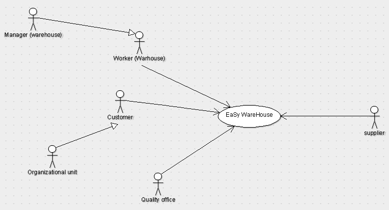
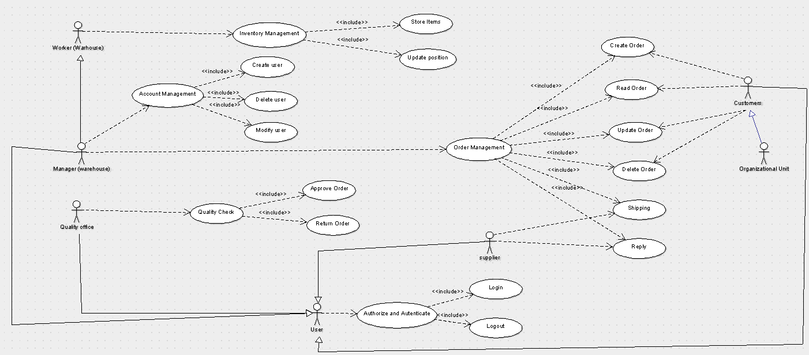
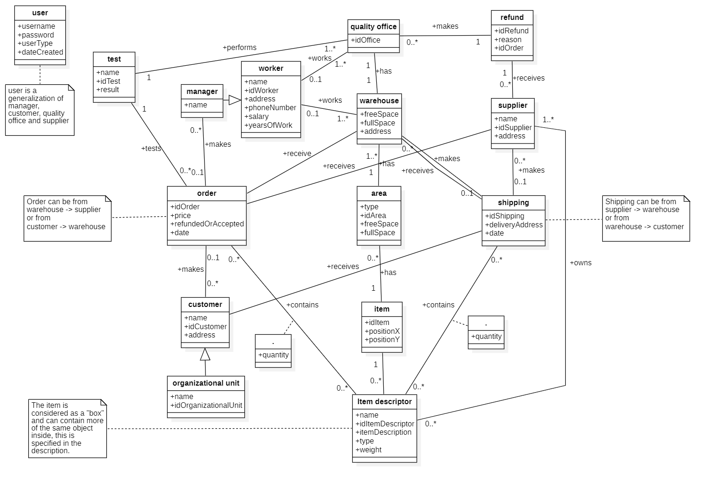
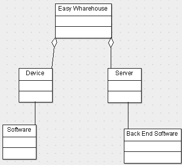
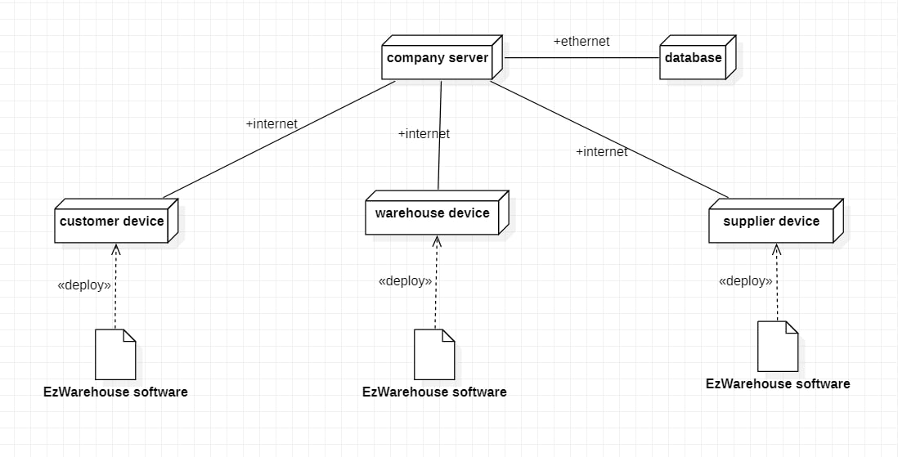

# Requirements Document

Date: 2 April 2022

Version: 0.0

| Version number | Change |
| -------------- | :----- |
|                |        |

# Homeworks

| Name | Work |
| ---- | :--- |
|      |      |

# Contents

- [Requirements Document](#requirements-document)
- [Homeworks](#homeworks)
- [Contents](#contents)
- [Informal description](#informal-description)
- [Stakeholders](#stakeholders)
- [Context Diagram and interfaces](#context-diagram-and-interfaces)
  - [Context Diagram](#context-diagram)
  - [Actors](#actors)
  - [Interfaces](#interfaces)
- [Stories and personas](#stories-and-personas)
- [Functional and non functional requirements](#functional-and-non-functional-requirements)
  - [Functional Requirements](#functional-requirements)
  - [Non Functional Requirements](#non-functional-requirements)
- [Use case diagram and use cases](#use-case-diagram-and-use-cases)
  - [Use case diagram](#use-case-diagram)
    - [Use case 1 Create Order , UC1](#use-case-1-create-order--uc1)
        - [Scenario 1.1 Nominal](#scenario-11-nominal)
        - [Scenario 1.2 Variant](#scenario-12-variant)
        - [Scenario 1.3 Exception 1](#scenario-13-exception-1)
        - [Scenario 1.4 Exception 2](#scenario-14-exception-2)
    - [Use case 2 Read Order, UC2](#use-case-2-read-order-uc2)
        - [Scenario 2.1 Nominal](#scenario-21-nominal)
        - [Scenario 2.2 Variant](#scenario-22-variant)
        - [Scenario 2.3 Variant](#scenario-23-variant)
    - [Use case 3 Update Order, UC3](#use-case-3-update-order-uc3)
        - [Scenario 3.1 Nominal](#scenario-31-nominal)
        - [Scenario 3.2 Variants](#scenario-32-variants)
        - [Scenario 3.3 Exception 1](#scenario-33-exception-1)
        - [Scenario 3.4 Exception 2](#scenario-34-exception-2)
    - [Use case 4 Delete Order , UC4](#use-case-4-delete-order--uc4)
        - [Scenario 4.1 Nominal](#scenario-41-nominal)
        - [Scenario 4.2 Variant](#scenario-42-variant)
        - [Scenario 4.3 Exception 1](#scenario-43-exception-1)
    - [Use case 5 Shipping, UC2](#use-case-5-shipping-uc2)
      - [Scenario 5.1 Nominal](#scenario-51-nominal)
      - [Scenario 5.2 Exception](#scenario-52-exception)
    - [Use Case 6 Reply, UC6](#use-case-6-reply-uc6)
      - [Scenario 6.1 Nominal](#scenario-61-nominal)
      - [Scenario 6.2 variant](#scenario-62-variant)
    - [Use Case 7 Create User, UC7](#use-case-7-create-user-uc7)
      - [Scenario 7.1 Nominal](#scenario-71-nominal)
      - [Scenario 7.2 Exception](#scenario-72-exception)
    - [Use Case 8 Delete User, UC8](#use-case-8-delete-user-uc8)
      - [Scenario 8.1 Nominal](#scenario-81-nominal)
    - [Use Case 9 Modify User, UC9](#use-case-9-modify-user-uc9)
      - [Scenario 9.1 Nominal](#scenario-91-nominal)
      - [Scenario 9.2 Exception](#scenario-92-exception)
    - [Use Case 10 Login, UC10](#use-case-10-login-uc10)
      - [Scenario 10.1 Nominal](#scenario-101-nominal)
      - [Scenario 10.2 Exception](#scenario-102-exception)
    - [Use Case 11 Logout, UC11](#use-case-11-logout-uc11)
      - [Scenario 11.1 Nominal](#scenario-111-nominal)
      - [Scenario 11.2 Exception](#scenario-112-exception)
    - [Use case 12 Approve Order , UC12](#use-case-12-approve-order--uc12)
        - [Scenario 12.1 Nominal](#scenario-121-nominal)
        - [Scenario 12.2 Variant 1](#scenario-122-variant-1)
        - [Scenario 12.3 Variant 2](#scenario-123-variant-2)
    - [Use case 13 return Order , UC13](#use-case-13-return-order--uc13)
        - [Scenario 13.1 Nominal](#scenario-131-nominal)
        - [Scenario 13.2 Variant](#scenario-132-variant)
    - [Use case 14 Store items, UC14](#use-case-14-store-items-uc14)
        - [Scenario 14.1 Nominal](#scenario-141-nominal)
        - [Scenario 14.2 Variants](#scenario-142-variants)
        - [Scenario 14.3 Exception](#scenario-143-exception)
    - [Use case 15 Update position, UC15](#use-case-15-update-position-uc15)
        - [Scenario 15.1 Nominal](#scenario-151-nominal)
        - [Scenario 15.2 Exception](#scenario-152-exception)
- [Glossary](#glossary)
- [System Design](#system-design)
- [Deployment Diagram](#deployment-diagram)

# Informal description

Medium companies and retailers need a simple application to manage the relationship with suppliers and the inventory of physical items stocked in a physical warehouse.
The warehouse is supervised by a manager, who supervises the availability of items. When a certain item is in short supply, the manager issues an order to a supplier. In general the same item can be purchased by many suppliers. The warehouse keeps a list of possible suppliers per item.

After some time the items ordered to a supplier are received. The items must be quality checked and stored in specific positions in the warehouse. The quality check is performed by specific roles (quality office), who apply specific tests for item (different items are tested differently). Possibly the tests are not made at all, or made randomly on some of the items received. If an item does not pass a quality test it may be rejected and sent back to the supplier.

Storage of items in the warehouse must take into account the availability of physical space in the warehouse. Further the position of items must be traced to guide later recollection of them.

The warehouse is part of a company. Other organizational units (OU) of the company may ask for items in the warehouse. This is implemented via internal orders, received by the warehouse. Upon reception of an internal order the warehouse must collect the requested item(s), prepare them and deliver them to a pick up area. When the item is collected by the other OU the internal order is completed.

EZWH (EaSy WareHouse) is a software application to support the management of a warehouse.

# Stakeholders

| Stakeholder name  | Description |
| ----------------- | :---------: |
| Company investors |             |
| Company CEO       |             |
| Company workers   |             |
| Suppliers         |             |
| Warehouse manager |             |
| Warehouse workers |             |
| Quality office    |             |
| Costumers         |             |
| Delivery drivers  |             |
| Company owner     |             |

# Context Diagram and interfaces

## Context Diagram

<!-- \<Define here Context diagram using UML use case diagram> -->

<!-- \<actors are a subset of stakeholders> -->

## Actors

- Customers <!-- Capire se si deve mettere anche questo o solo OU  -->
- Organizational Units
- Warehouse manager
- Warehouse workers
- Suppliers
- Quality office workers
- IT office

## Interfaces

<!-- \<describe here each interface in the context diagram -->

<!-- \<GUIs will be described graphically in a separate document> -->

| Actor                  |                 Logical Interface                 | Physical Interface |
| ---------------------- | :-----------------------------------------------: | -----------------: |
| Customers              |                 GUI - Make order                  |             Screen |
| Organizational Units   |                 GUI - Make order                  |             Screen |
| Warehouse manager      |    GUI - Crud order, manage items, manage area    |             Screen |
| Warehouse workers      |          GUI - Manage items, manage area          |             Screen |
| Suppliers              | GUI - Recive order, fulfill order, manage returns |             Screen |
| Quality office workers |        GUI - Review items, manage returns         |             Screen |

# Stories and personas

\<A Persona is a realistic impersonation of an actor. Define here a few personas and describe in plain text how a persona interacts with the system>

\<Persona is-an-instance-of actor>

\<stories will be formalized later as scenarios in use cases>

# Functional and non functional requirements

## Functional Requirements

\<In the form DO SOMETHING, or VERB NOUN, describe high level capabilities of the system>

\<they match to high level use cases>

| ID      |     Description      |
| ------- | :------------------: |
| FR1     |   Order Managment    |
| FR1.1   |     Create Order     |
| FR1.2   |      Read Order      |
| FR1.3   |     Update Order     |
| FR1.4   |     Delete Order     |
| FR1.5   |       Shipping       | <!-- Vedere se si deve togliere --> |
| FR1.6   |     Reply Order      |
| FR1.6.1 |    Confirm Order     |
| FR1.6.2 |     Reject Order     |
| FR2     |    Quality Check     |
| FR2.1   |     Aprove order     |
| FR2.2   |     Return order     |
| FR2.3   |    Register test     |
| FR3     | Inventory Management |
| FR3.1   |     Store items      |
| FR3.2   |   Update Position    |
| FR3.3   |      Send items      |
| FR4     |  Account managment   |
| FR4.1   |    Create account    |
| FR4.2   |    Update account    |
| FR4.3   |    Delete account    |

## Non Functional Requirements

<!-- \<Describe constraints on functional requirements> -->

| ID   | Type (efficiency, reliability, ..) |                     Description                     |   Refers to |
| ---- | :--------------------------------: | :-------------------------------------------------: | ----------: |
| NFR1 |            Reliability             |          Must have space in the warehouse           |         FR3 | <!-- Da chiedere --> |
| NFR2 |            Portability             |      Must work on Windows, Linux, Mac, Android      |             |
| NFR3 |              Security              |          Protection from malitious access           | Fr1,FR2,FR3 |
| NFR4 |             Usability              |      Effort needed to learn using the product       |             |
| NFR5 |               Space                | Minimum software memory available to register items |             |

# Use case diagram and use cases

## Use case diagram

\<next describe here each use case in the UCD>

### Use case 1 Create Order , UC1

| Actors Involved  |                  Customers, Manager                   |
| ---------------- | :---------------------------------------------------: |
| Precondition     |         Device must be connected on internet          |
| Post condition   |                 The order is received                 |
| Nominal Scenario | order data is inserted correctly and sent by Manager  |
| Variants         | order data is inserted correctly and sent by Customer |
| Exception 1      |     order data is inserted incorrectly by Manager     |
| Exception 2      |    order data is inserted incorrectly by Customer     |

##### Scenario 1.1 Nominal

\<describe here scenarios instances of UC1>

\<a scenario is a sequence of steps that corresponds to a particular execution of one use case>

\<a scenario is a more formal description of a story>

\<only relevant scenarios should be described>

| Scenario 1.1   |                                                                                               |
| -------------- | :-------------------------------------------------------------------------------------------: |
| Precondition   | Device must be connected on internet,  order data is inserted correctly, user type is manager |
| Post condition |                               the order is received by supplier                               |
| Step#          |                                          Description                                          |
| 1              |                                       user insert items                                       |
| 2              |                                  user insert items quantity                                   |
| 3              |                                     user insert supplier                                      |
| 4              |                                    user press send button                                     |
| 5              |                               application verify inserted data                                |
| 6              |                                    application send order                                     |
| 7              |                                 application show order recap                                  |

##### Scenario 1.2 Variant

| Scenario 1.2   |                                                                                                |
| -------------- | :--------------------------------------------------------------------------------------------: |
| Precondition   | Device must be connected on internet,  order data is inserted correctly, user type is customer |
| Post condition |                          the order is received by Warehouse's Manager                          |
| Step#          |                                          Description                                           |
| 1              |                                       user insert items                                        |
| 2              |                                   user insert items quantity                                   |
| 3              |                                  user insert delivery address                                  |
| 4              |                                     user press send button                                     |
| 5              |                                application verify inserted data                                |
| 6              |                                     application send order                                     |
| 7              |                           application show order recap (With price)                            |

##### Scenario 1.3 Exception 1

| Scenario 1.3   |                                                                                                 |
| -------------- | :---------------------------------------------------------------------------------------------: |
| Precondition   | Device must be connected on internet,  order data is inserted incorrectly, user type is manager |
| Post condition |                                      the order in not sent                                      |
| Step#          |                                           Description                                           |
| 1              |                                        user insert items                                        |
| 2              |                                   user insert items quantity                                    |
| 3              |                                      user insert supplier                                       |
| 4              |                                     user press send button                                      |
| 5              |                                application verify inserted data                                 |
| 6              |                                 application show error message                                  |

##### Scenario 1.4 Exception 2

| Scenario 1.4   |                                                                                                  |
| -------------- | :----------------------------------------------------------------------------------------------: |
| Precondition   | Device must be connected on internet,  order data is inserted incorrectly, user type is customer |
| Post condition |                                      the order in not sent                                       |
| Step#          |                                           Description                                            |
| 1              |                                        user insert items                                         |
| 2              |                                    user insert items quantity                                    |
| 3              |                                   user insert delivery address                                   |
| 4              |                                      user press send button                                      |
| 5              |                                 application verify inserted data                                 |
| 6              |                                  application show error message                                  |

### Use case 2 Read Order, UC2

| Actors Involved  |                                       Worker                                        |
| ---------------- | :---------------------------------------------------------------------------------: |
| Precondition     | Device must be connected to the internet, a search parameter for the order is given |
| Post condition   |                   Orders are retrived to the requesting interface                   |
| Nominal Scenario |                     Orders are correctly selected and retrived                      |
| Variants         |                          No order has been found or exist                           |
| Exception 1      |                              Wrong orders are retrived                              |

##### Scenario 2.1 Nominal

| Scenario 2.1   |                                                                                 |
| -------------- | :-----------------------------------------------------------------------------: |
| Precondition   | Device must be connected to the internet, order data has been inserted inserted |
| Post condition |                    Orders are recived by the requsting user                     |
| Step#          |                                   Description                                   |
| 1              |                         User inserts search parameters                          |
| 2              |                            User press search button                             |
| 3              |                        Application verify inserted data                         |
| 4              |                           Application retrives order                            |
| 5              |                     Application searches for matching data                      |
| 6              |                      Application shows order on interface                       |

##### Scenario 2.2 Variant

| Scenario 2.2   |                                                                   |
| -------------- | :---------------------------------------------------------------: |
| Precondition   | Device must be connected to the internet, order data is inserted  |
| Post condition | It is anounced to the user that no correct orders have been found |
| Step#          |                            Description                            |
| 1              |                  User inserts search parameters                   |
| 2              |                     User press search button                      |
| 3              |                 Application verify inserted data                  |
| 4              |              Application searches for matching data               |
| 5              |              Alert about lack of results is created               |
| 6              |                Application shows alert to the user                |

##### Scenario 2.3 Variant

| Scenario 2.3   |                                                                  |
| -------------- | :--------------------------------------------------------------: |
| Precondition   | Device must be connected to the internet, order data is inserted |
| Post condition |             Wrong data is retrived to the interface              |
| Step#          |                           Description                            |
| 1              |                  User inserts search parameters                  |
| 2              |                     User press search button                     |
| 3              |                 Application verify inserted data                 |
| 4              |              Application searches for matching data              |
| 5              |       Application returns incomplete/wrong list of orders        |
| 6              |               Alert about wrong results is created               |
| 7              |               Application shows alert to the user                |

### Use case 3 Update Order, UC3

| Actors Involved  |                  Customers, Manager                  |
| ---------------- | :--------------------------------------------------: |
| Precondition     |       Device must be connected to the internet       |
| Post condition   |    Attributes of an order are changed and stored     |
| Nominal Scenario | Order data is changed correctly and sent by Manager  |
| Variants         | Order data is changed correctly and sent by Customer |
| Exception 1      |    Order data is inserted incorrectly by Manager     |
| Exception 2      |    Order data is inserted incorrectly by Customer    |

##### Scenario 3.1 Nominal

| Scenario 3.1   |                                                                                                 |
| -------------- | :---------------------------------------------------------------------------------------------: |
| Precondition   | Device must be connected to the internet, order data is changed correctly, user type is manager |
| Post condition |                     The order is updated and stored correctly in the system                     |
| Step#          |                                           Description                                           |
| 1              |                                        User selects item                                        |
| 2              |                                     User updates attributes                                     |
| 3              |                                     User press save button                                      |
| 4              |                                 Application verify changed data                                 |
| 5              |                              Application updates and stores order                               |
| 6              |                                  Application show order recap                                   |

##### Scenario 3.2 Variants

| Scenario 3.2   |                                                                                                  |
| -------------- | :----------------------------------------------------------------------------------------------: |
| Precondition   | Device must be connected to the internet, order data is changed correctly, user type is customer |
| Post condition |                     The order is updated and stored correctly in the system                      |
| Step#          |                                           Description                                            |
| 1              |                                        User selects item                                         |
| 2              |                                     User updates attributes                                      |
| 3              |                                      User press save button                                      |
| 4              |                                 Application verify inserted data                                 |
| 5              |                               Application updates and stores order                               |
| 6              |                                   Application show order recap                                   |

##### Scenario 3.3 Exception 1

| Scenario 3.3   |                                                                                                    |
| -------------- | :------------------------------------------------------------------------------------------------: |
| Precondition   | Device must be connected to the internet, order data is inserted incorrectly, user type is manager |
| Post condition |                The order in not changed, incorrect spaces are anouunced to the user                |
| Step#          |                                            Description                                             |
| 1              |                                         User selects item                                          |
| 2              |                                      User updates attributes                                       |
| 4              |                                       User press save button                                       |
| 5              |                                  Application verify inserted data                                  |
| 6              |                                   Application show error message                                   |

##### Scenario 3.4 Exception 2

| Scenario 3.4   |                                                                                                     |
| -------------- | :-------------------------------------------------------------------------------------------------: |
| Precondition   | Device must be connected to the internet, order data is inserted incorrectly, user type is customer |
| Post condition |                The order in not changed, incorrect spaces are anouunced to the user                 |
| Step#          |                                             Description                                             |
| 1              |                                          User selects item                                          |
| 2              |                                       User updates attributes                                       |
| 4              |                                       User press save button                                        |
| 5              |                                  Application verify inserted data                                   |
| 6              |                                   Application show error message                                    |

### Use case 4 Delete Order , UC4

| Actors Involved  |                                    Customers, Manager                                     |
| ---------------- | :---------------------------------------------------------------------------------------: |
| Precondition     | Device must be connected to the internet, the user has the privilages to delete the order |
| Post condition   |                              An order is removed from system                              |
| Nominal Scenario |                      An order to be deleted is selected by a manager                      |
| Variants         |                     An order to be deleted is selected by a costumer                      |
| Exception 1      |                    An wrong order to be deleted is selected by a user                     |

##### Scenario 4.1 Nominal

| Scenario 4.1   |                                                                |
| -------------- | :------------------------------------------------------------: |
| Precondition   | Device must be connected to the internet, user type is manager |
| Post condition |                   The order has been removed                   |
| Step#          |                          Description                           |
| 1              |                       User selects order                       |
| 3              |                    User press remove button                    |
| 4              |        Application ask user if its sure of this action         |
| 5              |                     User confirms decision                     |
| 6              |                 Application verify privilages                  |
| 7              |             Application deletes order from system              |

##### Scenario 4.2 Variant

| Scenario 4.2   |                                                                 |
| -------------- | :-------------------------------------------------------------: |
| Precondition   | Device must be connected to the internet, user type is customer |
| Post condition |                   The order has been removed                    |
| Step#          |                           Description                           |
| 1              |                       User selects order                        |
| 3              |                    User press remove button                     |
| 4              |         Application ask user if its sure of this action         |
| 5              |                     User confirms decision                      |
| 6              |                  Application verify privilages                  |
| 7              |              Application deletes order from system              |

##### Scenario 4.3 Exception 1

| Scenario 4.3   |                                                 |
| -------------- | :---------------------------------------------: |
| Precondition   |    Device must be connected to the internet     |
| Post condition |           The order has been removed            |
| Step#          |                   Description                   |
| 1              |               User selects order                |
| 3              |            User press remove button             |
| 4              | Application ask user if its sure of this action |
| 5              |              User rejects decision              |
| 6              |     Application returns to order selection      |

### Use case 5 Shipping, UC2

| Actors Involved  |                            Supplier, Manager                            |
| ---------------- | :---------------------------------------------------------------------: |
| Precondition     | An order has been received and confirmed by user, user is in order page |
| Post condition   |                    The items and an invoice are sent                    |
| Nominal Scenario |         all the items are available , shipping data are correct         |
| Exception        |            items are available, shipping data are incorrect             |

#### Scenario 5.1 Nominal

| Scenario 5.1   |                                                                                                      |
| -------------- | :--------------------------------------------------------------------------------------------------: |
| Precondition   | An order has been received and confirmed by user, user is in order page, all the items are available |
|                |                                      shipping data are correct                                       |
| Post condition |                                  The items and an invoice are sent                                   |
| Step#          |                                             Description                                              |
| 1              |                                        user press send button                                        |
| 2              |                                  application asks for confirmation                                   |
| 3              |                                      user press confirm button                                       |
| 4              |                               application compute and make an invoice                                |
| 5              |                                  application send invoice by email                                   |
| 6              |                         application show a confirmation message to the user                          |

<!-- L'applicazione/sistema va messo come attore? -->
<!-- Il supplier deve inserire i propri prodotti nell'app? nel caso d'uso inventory management? -->

#### Scenario 5.2 Exception
| Scenario 5.2   |                                                                                                          |
| -------------- | :------------------------------------------------------------------------------------------------------: |
| Precondition   | An order has been received and confirmed by user, user is in order page, not all the items are available |
|                |                                        shipping data are correct                                         |
| Post condition |                                    The items and an invoice are sent                                     |
| Step#          |                                               Description                                                |
| 1              |                                         user press modify button                                         |
| 2              |                                       application show modify page                                       |
| 3              |                                            user modify order                                             |
| 4              |                           user write on a field the motivation to change order                           |
| 4              |                                          user press send button                                          |
| 5              |                                     application verify inserted data                                     |
| 6              |                                      application show error message                                      |

### Use Case 6 Reply, UC6

| Actors Involved  |                 Supplier, Manager                  |
| ---------------- | :------------------------------------------------: |
| Precondition     | An order has been received , user is in order page |
| Post condition   |                 A message is sent                  |
| Nominal Scenario |            all the items are available             |
| variant          |              items are not available               |

#### Scenario 6.1 Nominal

| Scenario 6.1   |                                                                                 |
| -------------- | :-----------------------------------------------------------------------------: |
| Precondition   | An order has been received , user is in order page, all the items are available |
| Post condition |                                A message is sent                                |
| Step#          |                                   Description                                   |
| 1              |                            user press confirm button                            |
| 2              |                        application asks for confirmation                        |
| 3              |                              user press yes button                              |
| 4              |                     application make a confirmation message                     |
| 5              |                          application send the message                           |

#### Scenario 6.2 variant 

| Scenario 6.2   |                                                                             |
| -------------- | :-------------------------------------------------------------------------: |
| Precondition   | An order has been received , user is in order page, items are not available |
| Post condition |                              A message is sent                              |
| Step#          |                                 Description                                 |
| 1              |                          user press reject button                           |
| 2              |                      application asks for confirmation                      |
| 3              |                            user press yes button                            |
| 4              |                      application make a reject message                      |
| 5              |                        application send the message                         |

### Use Case 7 Create User, UC7

| Actors Involved  |       Manager       |
| ---------------- | :-----------------: |
| Precondition     | User does not exist |
| Post condition   | New user is created |
| Nominal Scenario |    User Creation    |
| Exception        | user already exist  |

#### Scenario 7.1 Nominal

| Scenario 7.1   |                                         |
| -------------- | :-------------------------------------: |
| Precondition   |           User does not exist           |
| Post condition |           New user is created           |
| Step#          |               Description               |
| 1              | Manager press create new account button |
| 2              |       application asks user data        |
| 3              |           Manager insert data           |
| 4              |       Manager press create button       |
| 5              | application check if user alredy exists |
| 6              |       application create new user       |

#### Scenario 7.2 Exception

| Scenario 7.2   |                                         |
| -------------- | :-------------------------------------: |
| Precondition   |           User already exist            |
| Post condition |                no change                |
| Step#          |               Description               |
| 1              |   Manager press create account button   |
| 2              |       application asks user data        |
| 3              |           Manager insert data           |
| 4              | application check if user alredy exists |
| 5              |    application show an error message    |

### Use Case 8 Delete User, UC8

| Actors Involved  |                     Manager                      |
| ---------------- | :----------------------------------------------: |
| Precondition     | User already exist, Manager is in user list page |
| Post condition   |              User has been deleted               |
| Nominal Scenario |                       ???                        |
| Exception        |                       ???                        |

#### Scenario 8.1 Nominal

| Scenario 8.1   |                                                  |
| -------------- | :----------------------------------------------: |
| Precondition   | User already exist, Manager is in user list page |
| Post condition |              User has been deleted               |
| Step#          |                   Description                    |
| 1              |           Manager press delete button            |
| 2              |        application asks for confirmation         |
| 3              |              user press yes button               |
| 4              |           application delete that user           |

### Use Case 9 Modify User, UC9

| Actors Involved  |                   Manager                   |
| ---------------- | :-----------------------------------------: |
| Precondition     | User already exist, Manager is in user page |
| Post condition   |           User has been modified            |
| Nominal Scenario |            User data are correct            |
| Exception        |           User data are incorrect           |

#### Scenario 9.1 Nominal

| Scenario 9.1   |                                                                     |
| -------------- | :-----------------------------------------------------------------: |
| Precondition   | User already exist, Manager is in user page,  User data are correct |
| Post condition |                       User has been modified                        |
| Step#          |                             Description                             |
| 1              |                     Manager press modify button                     |
| 2              |                     application show user data                      |
| 3              |                         Manager modify data                         |
| 4              |               application check if user alredy exists               |
| 5              |                application check if data are correct                |
| 6              |                    application modify user data                     |

#### Scenario 9.2 Exception

| Scenario 9.2   |                                                                       |
| -------------- | :-------------------------------------------------------------------: |
| Precondition   | User already exist, Manager is in user page,  User data are incorrect |
| Post condition |                               no change                               |
| Step#          |                              Description                              |
| 1              |                      Manager press modify button                      |
| 2              |                      application show user data                       |
| 3              |                          Manager modify data                          |
| 4              |                application check if user alredy exists                |
| 5              |                 application check if data are correct                 |
| 6              |                   application show an error message                   |

### Use Case 10 Login, UC10

| Actors Involved  |           User           |
| ---------------- | :----------------------: |
| Precondition     |           ???            | <!-- Da vedere --> |
| Post condition   |      User is logged      |
| Nominal Scenario |  login data are correct  |
| Exception        | login data are incorrect |

#### Scenario 10.1 Nominal

| Scenario 10.1  |                                     |
| -------------- | :---------------------------------: |
| Precondition   |       login data are correct        |
| Post condition | User is logged in his personal page |
| Step#          |             Description             |
| 1              |   user insert email and password    |
| 2              |       user press login button       |
| 3              |       application verify data       |

#### Scenario 10.2 Exception

| Scenario 10.2  |                                   |
| -------------- | :-------------------------------: |
| Precondition   |     login data are incorrect      |
| Post condition |        User is not logged         |
| Step#          |            Description            |
| 1              |  user insert email and password   |
| 2              |      user press login button      |
| 3              |      application verify data      |
| 4              | application show an error message |

### Use Case 11 Logout, UC11

| Actors Involved  |            User            |
| ---------------- | :------------------------: |
| Precondition     |       User is logged       |
| Post condition   |  User is in the land page  |
| Nominal Scenario |   User finished his job    |
| Exception        | User are working on a page | <!-- Da vedere -->

#### Scenario 11.1 Nominal

| Scenario 11.1  |                                                       |
| -------------- | :---------------------------------------------------: |
| Precondition   |                    User is logged                     |
| Post condition |               User is in the land page                |
| Step#          |                      Description                      |
| 1              |               user press logout button                |
| 2              | application verify that the user has finished all job |
| 3              |                application logout user                |

#### Scenario 11.2 Exception

| Scenario 11.2  |                                                       |
| -------------- | :---------------------------------------------------: |
| Precondition   |                    User is logged                     |
| Post condition |                       no change                       |
| Step#          |                      Description                      |
| 1              |               user press logout button                |
| 2              | application verify that the user has finished all job |
| 3              |           application show an error message           |

### Use case 12 Approve Order , UC12

| Actors Involved  |                                 Quality Office                                  |
| ---------------- | :-----------------------------------------------------------------------------: |
| Precondition     |                    A new order is received from the supplier                    |
| Post condition   |                              The order is approved                              |
| Nominal Scenario |     the quality office executes tests on all of the items and approves them     |
| variant 1        | the quality office executes some tests on a part of the items and approves them |
| variant 2        |                  the quality office doesn't executes any tests                  |

##### Scenario 12.1 Nominal

| Scenario 12.2  |                                                                                                |
| -------------- | :--------------------------------------------------------------------------------------------: |
| Precondition   | A new order is received from the supplier, the quality office decides to test all of the items |
| Post condition |                  the order is marked as approved and stored in the warehouse                   |
| Step#          |                                          Description                                           |
| 1              |                               order is received by the warehouse                               |
| 2              |                  quality office decides to test all of the items in the order                  |
| 3              |                                 quality offices executes tests                                 |
| 4              |                                      tests are successful                                      |
| 5              |                 quality office marks the items as approved on the application                  |
| 6              |                               items are stored in the warehouse                                |

##### Scenario 12.2 Variant 1

| Scenario 12.2  |                                                                                                        |
| -------------- | :----------------------------------------------------------------------------------------------------: |
| Precondition   | A new order is received from the supplier, the quality office decides to test only a part of the items |
| Post condition |                      the order is marked as approved and stored in the warehouse                       |
| Step#          |                                              Description                                               |
| 1              |                                   order is received by the warehouse                                   |
| 2              |                           quality office decides to test a part of the items                           |
| 3              |                                     quality offices executes tests                                     |
| 4              |                                          test are successful                                           |
| 5              |                     quality office marks the items as approved on the application                      |
| 6              |                                   items are stored in the warehouse                                    |

##### Scenario 12.3 Variant 2

| Scenario 12.3  |                                                               |
| -------------- | :-----------------------------------------------------------: |
| Precondition   |           A new order is received from the supplier           |
| Post condition |      the order is not tested and stored in the warehouse      |
| Step#          |                          Description                          |
| 1              |              order is received by the warehouse               |
| 2              |         quality office decides not to test the items          |
| 3              | quality office marks the items as approved on the application |
| 4              |               items are stored in the warehouse               |

### Use case 13 return Order , UC13

| Actors Involved  |                                   Quality Office                                    |
| ---------------- | :---------------------------------------------------------------------------------: |
| Precondition     | A new order is received from the supplier and the quality office decides to test it |
| Post condition   |                                The order is returned                                |
| Nominal Scenario |       the quality office executes tests on all of the items and returns them        |
| Variant          |   the quality office executes some tests on a part of the items and returns them    |

##### Scenario 13.1 Nominal

| Scenario 13.1  |                                                                                                |
| -------------- | :--------------------------------------------------------------------------------------------: |
| Precondition   | A new order is received from the supplier, the quality office decides to test all of the items |
| Post condition |              the order is marked as to be returned and sent back to the supplier               |
| Step#          |                                          Description                                           |
| 1              |                               order is received by the warehouse                               |
| 2              |                        quality office decides to test all of the items                         |
| 3              |                                 quality offices executes tests                                 |
| 4              |                                    tests are not successful                                    |
| 5              |              quality office marks the items as to be returned on the application               |
| 6              |                              items are sent back to the supplier                               |

##### Scenario 13.2 Variant

| Scenario 13.2  |                                                                                                        |
| -------------- | :----------------------------------------------------------------------------------------------------: |
| Precondition   | A new order is received from the supplier, the quality office decides to test only a part of the items |
| Post condition |                     the order is marked as returned and sent back to the supplier                      |
| Step#          |                                              Description                                               |
| 1              |                                   order is received by the warehouse                                   |
| 2              |                           quality office decides to partially test the items                           |
| 3              |                                     quality offices executes tests                                     |
| 4              |                                        tests are not successful                                        |
| 5              |                  quality office marks the items as to be refunded on the application                   |
| 6              |                                  items are sent back to the supplier                                   |

### Use case 14 Store items, UC14

| Actors Involved  |                        Manager, Worker                         |
| ---------------- | :------------------------------------------------------------: |
| Precondition     |     Order has been checked, Items are not in the warehouse     |
| Post condition   |            Items are positioneted in the warehouse             |
| Nominal Scenario |   Same type items are correctly positioned in the warehouse    |
| Variants         | Different type items are correctly positioned in the warehouse |
| Exception        |       Items are incorrectly positioned in the warehouse        |

##### Scenario 14.1 Nominal 
                                                      
| Scenario 14.1  |                                                                                          |
| -------------- | :--------------------------------------------------------------------------------------: |
| Precondition   | Order has been checked, Items are not in the warehouse, items are correctly positionated |
| Post condition |                          Items are positioned in the warehouse                           |
| Step#          |                                       Description                                        |
| 1              |                                 Worker insert items type                                 |
| 2              |                       Application returns area for that items type                       |
| 3              |                              Worker inserts items quantity                               |
| 4              |                              Worker inserts items position                               |
| 5              |                                 Worker press SAVE button                                 |
| 6              |                            Application verifies inserted data                            |
| 7              |                            Application shows success message                             |

##### Scenario 14.2 Variants

| Scenario 14.2  |                                                                                          |
| -------------- | :--------------------------------------------------------------------------------------: |
| Precondition   | Order has been checked, Items are not in the warehouse, items are correctly positionated |
| Post condition |                         Items are positioneted in the warehouse                          |
| Step#          |                                       Description                                        |
| 1              |                                Worker inserts items type                                 |
| 2              |                       Application returns area for that items type                       |
| 3              |                       Worker inserts items quantity for that type                        |
| 4              |                       Worker inserts items position for that type                        |
| 5              |                         Worker repeats 1,2,3 and 4 for each type                         |
| 6              |                                 Worker press SAVE button                                 |
| 7              |                            Application verifies inserted data                            |
| 8              |                            Application shows success message                             |

##### Scenario 14.3 Exception

| Scenario 14.3  |                                                                                            |
| -------------- | :----------------------------------------------------------------------------------------: |
| Precondition   | Order has been checked, items are not in the warehouse, items are incorrectly positionated |
| Post condition |                        Items are not positioneted in the warehouse                         |
| Step#          |                                        Description                                         |
| 1              |                                  Worker inserts item type                                  |
| 2              |                               Worker inserts items quantity                                |
| 3              |                                  Worker inserts position                                   |
| 5              |                                  Worker press SAVE button                                  |
| 6              |                             Application verifies inserted data                             |
| 7              |                              Application shows error message                               |
  
                                                   
### Use case 15 Update position, UC15

| Actors Involved  |           Manager, Worker            |
| ---------------- | :----------------------------------: |
| Precondition     |     Items are in the A position      |
| Post condition   |     Items are in the B position      |
| Nominal Scenario | Items position are correctly updated |
| Exception        |   Position is incorrectly updated    |

##### Scenario 15.1 Nominal 

| Scenario 15.1  |                                                            |
| -------------- | :--------------------------------------------------------: |
| Precondition   |   Items are in the A position, items are correctly moved   |
| Post condition |                Items are in the B position                 |
| Step#          |                        Description                         |
| 1              |      Worker searches for the items in the items list       |
| 2              | Worker modifies position A with position B for those items |
| 3              |                  Worker press SAVE button                  |
| 4              |             Application verifies inserted data             |
| 5              |             Application shows success message              |

##### Scenario 15.2 Exception 

| Scenario 15.2  |                                                          |
| -------------- | :------------------------------------------------------: |
| Precondition   | Items are in the A position, items are incorrectly moved |
| Post condition |               Items are in the A position                |
| Step#          |                       Description                        |
| 1              |      Worker searches for the item on the items list      |
| 2              | Worker modifies position A with position B for that item |
| 3              |                 Worker press SAVE button                 |
| 4              |            Application verifies inserted data            |
| 5              |             Application shows error message              |

..

# Glossary

# System Design

# Deployment Diagram

